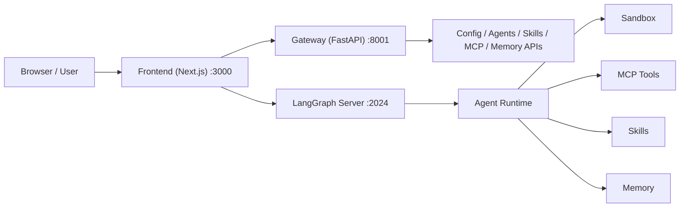
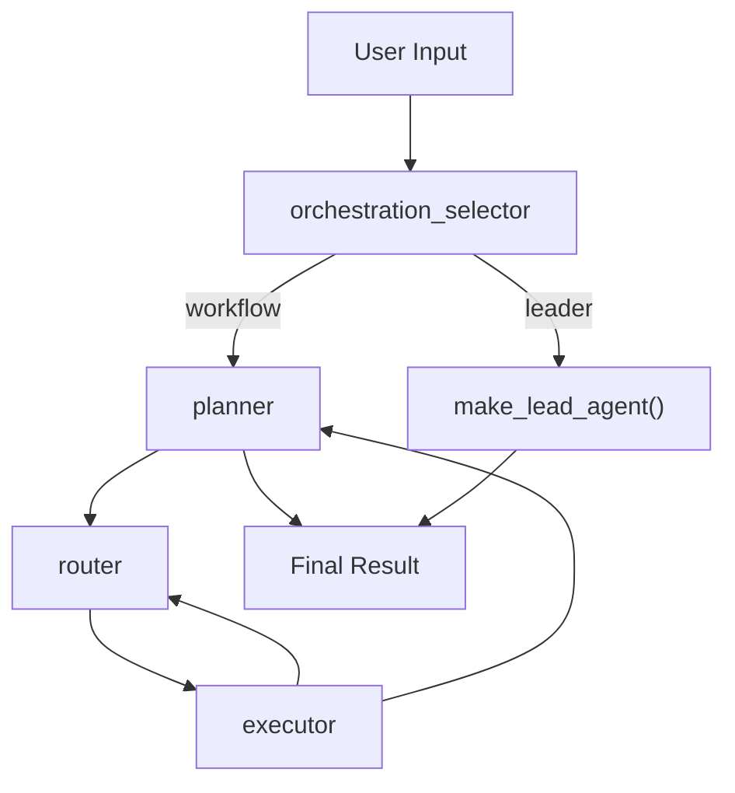

# 当前项目架构详细说明文档

更新时间：2026-03-11

## 1. 文档目的

本文档基于 `E:\work\deer-flow` 当前代码实际实现情况整理，目标是回答 4 个问题：

1. 当前项目到底由哪些子系统组成。
2. 当前项目已经具备哪些功能。
3. 当前项目的执行链路、状态流转、前后端协作方式是什么。
4. 当前实现与多智能体设计目标相比，已经做到哪里，还差什么。

本文档描述的是“代码现状”，不是理想架构，也不是未来规划。

---

## 2. 总体结论

当前项目不是单一形态的 Agent 系统，而是一个同时包含两条主运行路径的 Agent 平台：

1. `leader` 路径：保留 DeerFlow 原生的 lead-agent + tool/subagent 工作方式。
2. `workflow` 路径：新增的多智能体编排链路，采用 `Planner -> Router -> Executor -> Domain Agent` 结构。

因此，当前项目更准确的定位是：

> 一个基于 LangGraph 的 Agent 平台，在保留 DeerFlow 原有单主智能体能力的同时，逐步演进为支持配置驱动领域智能体编排的混合架构系统。

从代码现状看，平台已经具备：

- 通用聊天与工具调用
- 子智能体委派
- 多智能体 workflow 编排
- 领域 Agent 注册与装配
- MCP 工具配置与按 Agent 隔离加载
- Sandbox 文件系统与命令执行
- Skills 机制
- 长期记忆
- 文件上传与产物查看
- 前端工作台、任务进度可视化、设置中心

但它还不是最终目标态，主要因为：

- `engine_type` 虽然已经支持配置，但还没有真正演化成“独立执行引擎注册表 + 独立 engine 实现类”。
- workflow 仍然是串行执行，不支持真正的多任务并行调度。
- Agent 管理 API / 前端管理面还没有完整暴露 `engine_type` 等新能力。

---

## 3. 仓库结构概览

### 3.1 顶层目录

- `backend/`
  负责 LangGraph、FastAPI Gateway、配置加载、MCP、Sandbox、Memory、Skills、多智能体编排。
- `frontend/`
  负责 Next.js 工作台、聊天界面、任务面板、产物面板、Agent 管理与设置页。
- `scripts/`
  本地开发服务启动/停止脚本。
- `docs/`
  补充设计文档和阶段性协议文档。
- `skills/`
  DeerFlow 技能目录。
- `backend/.deer-flow/agents/`
  当前已注册的业务领域智能体目录。

### 3.2 当前已配置的业务领域 Agent

- `meeting-agent`
  会议室预订、会议查询、修改、取消等。
- `contacts-agent`
  员工通讯录、组织结构、openId 等只读查询。
- `hr-agent`
  HR 考勤/请假查询。

### 3.3 当前内置 Subagent

- `general-purpose`
  通用探索型子智能体。
- `bash`
  命令执行型子智能体。

---

## 4. 运行时总览

当前本地开发默认会启动 3 个服务：

### 4.1 Frontend

负责：

- 工作台路由
- 聊天界面
- 流式消息消费
- 任务进度展示
- 产物浏览
- Agent 管理
- 设置中心

### 4.2 Gateway

负责：

- 模型列表 API
- MCP 配置 API
- Skills 管理 API
- Memory 状态 API
- Upload / Artifact API
- Agent CRUD API
- USER.md 用户画像 API

### 4.3 LangGraph Server

负责：

- 运行 `entry_graph`
- 根据输入选择 `leader` 或 `workflow`
- 执行工具、子智能体、领域智能体和状态图流转

---

## 5. 当前核心架构：双编排模式

当前系统不是“只剩 workflow”，而是双模式共存：

### 5.1 `entry_graph`

入口图由 `backend/src/agents/entry_graph.py` 负责：

- 首先执行 `orchestration_selector`
- 如果判定为 `leader`，直接走 DeerFlow 原生 lead agent
- 如果判定为 `workflow`，进入多智能体图

### 5.2 `orchestration_selector`

当前选择策略基于以下信息：

- 用户输入特征
- 是否像多步骤/多目标任务
- 用户是否显式指定 `leader` / `workflow`
- Agent 默认配置 `requested_orchestration_mode`
- 是否处于澄清恢复阶段

当前是启发式决策，不是复杂学习式路由。

---

## 6. Backend 架构说明

## 6.1 配置层

### 6.1.1 全局配置

`config.yaml` 负责定义：

- 模型列表
- 工具组
- 全局工具
- Sandbox 模式
- Skills 路径
- Title 生成
- Summarization
- Memory
- Subagents 超时

### 6.1.2 扩展配置

`extensions_config.json` 负责定义：

- MCP 服务器配置
- Skills 启用状态

### 6.1.3 业务 Agent 配置

`backend/.deer-flow/agents/<agent-name>/config.yaml` 负责定义：

- `name`
- `description`
- `model`
- `engine_type`
- `tool_groups`
- `domain`
- `system_prompt_file`
- `hitl_keywords`
- `max_tool_calls`
- `mcp_servers`
- `available_skills`
- `requested_orchestration_mode`

### 6.1.4 当前 `engine_type` 语义

当前预设支持 3 种显式配置值：

- `ReadOnly_Explorer`
- `ReAct`
- `SOP`

如果不设置 `engine_type`，运行时回退到当前 `meeting-agent` 风格的默认模式。

注意：当前的 `engine_type` 还是“轻量模式开关”，并不是完全独立的引擎类体系，详见第 11 章。

---

## 6.2 模型层

模型由 `backend/src/models` 和 `config.yaml` 管理，当前能力包括：

- 多模型注册
- 可选 thinking 模式
- 可选 reasoning_effort
- 按 agent 或按请求覆盖模型

前端通过 Gateway 的 `/api/models` 获取可用模型元信息。

---

## 6.3 工具层

当前工具来源分为 4 类：

1. 全局配置工具
2. 内置工具
3. MCP 工具
4. 子智能体工具

### 6.3.1 全局配置工具

来自 `config.yaml` 的 `tools` 配置，当前默认包括：

- `web_search`
- `web_fetch`
- `image_search`
- `ls`
- `read_file`
- `write_file`
- `str_replace`
- `bash`

### 6.3.2 内置工具

来自 `backend/src/tools/builtins/`，当前包括：

- `ask_clarification`
- `request_help`
- `present_file`
- `task`
- `view_image`
- `setup_agent`

### 6.3.3 MCP 工具

当前有两种 MCP 装配模式：

1. 顶层 lead agent 使用全局 cached MCP。
2. workflow domain agent 使用按 Agent 单独初始化的 MCP pool。

这意味着：

- 顶层模式仍可见全局 MCP
- 领域 Agent 当前已经改为只加载自己的专属 MCP，不再共享全局 MCP

### 6.3.4 子智能体工具

当顶层 agent 开启 `subagent_enabled` 时，会暴露 `task` 工具，允许委派给：

- `general-purpose`
- `bash`

---

## 6.4 Sandbox 与文件系统

当前平台保留了 DeerFlow 原有沙箱机制，支持：

- Local Sandbox
- Docker Sandbox
- Provisioner / Kubernetes 模式

线程级目录语义如下：

- `uploads`
  用户上传文件
- `workspace`
  运行时工作区
- `outputs`
  产物输出目录

当前能力包括：

- 工具层访问文件系统
- 命令执行
- 上传文件自动写入线程目录
- 可选将 Office / PDF 转 Markdown
- 产物通过 API 回显给前端

---

## 6.5 Skills 体系

当前 Skills 仍沿用 DeerFlow 机制：

- 从 `skills/public` 和 `skills/custom` 递归扫描
- 解析 `SKILL.md`
- 根据 `extensions_config.json` 判断是否启用
- 通过 prompt 注入与渐进式加载供 Agent 使用

当前 Gateway 支持：

- 列出技能
- 查询单个技能
- 启用/禁用技能
- 安装 `.skill` 归档文件

---

## 6.6 Memory 体系

当前长期记忆仍然是 DeerFlow 的平台级能力，主要包括：

- Memory 数据文件读取
- Memory 状态 API
- MemoryMiddleware 过滤消息并异步写入记忆队列
- Prompt 注入记忆上下文

注意：

- 顶层 agent 会使用 MemoryMiddleware
- workflow domain agent 当前默认跳过 MemoryMiddleware，避免子任务污染长期记忆

因此当前的“领域 Agent 记忆”还是弱实现，主要是目录级 `memory.json` 和 prompt 资源组织，还不是完整的 agent-level 持久经验系统。

---

## 6.7 Lead Agent 路径

`leader` 路径仍然是 DeerFlow 原生主智能体模式，核心特点是：

- 一个顶层 Agent 直接拥有工具和技能
- 可选择直接调用工具
- 可选择调用子智能体
- 支持 TodoList、Clarification、Title、Memory、Summarization 等中间件

适用场景：

- 开放式问答
- 代码探索
- 文件处理
- 较轻量任务
- 不需要领域隔离的场景

---

## 6.8 多智能体 Workflow 路径

### 6.8.1 状态模型

workflow 共享状态定义在 `backend/src/agents/thread_state.py`，核心字段包括：

- `original_input`
- `planner_goal`
- `task_pool`
- `verified_facts`
- `route_count`
- `execution_state`
- `final_result`
- `requested_orchestration_mode`
- `resolved_orchestration_mode`
- `run_id`

### 6.8.2 Planner

`planner` 负责：

- 首轮任务拆解
- 将用户目标写入 `planner_goal`
- 在所有任务结束后进行目标校验
- 输出最终回复
- 处理“新问题 vs 澄清恢复”的轮次区分

### 6.8.3 Router

`router` 负责：

- 从 `task_pool` 里选待执行任务
- 给任务分配领域 Agent
- 处理 `request_help`
- 在 helper 完成后恢复父任务
- 在需要时直接中断给用户提澄清问题
- 使用 `route_count` 避免异常循环

### 6.8.4 Executor

`executor` 负责：

- 执行当前 `RUNNING` 任务
- 初始化该领域 Agent 所需 MCP
- 调用领域 Agent
- 解析 `request_help`
- 解析 `ask_clarification`
- 将结果写入 `verified_facts`
- 发出前端任务事件

### 6.8.5 Domain Agent

workflow 中的领域 Agent 统一由 `make_lead_agent()` 创建，但运行时会附加 domain-agent 语义：

- `is_domain_agent=True`
- 关闭全局 MCP 注入
- 使用 per-agent MCP pool
- 使用 `HelpRequestMiddleware`
- 跳过 Title / Memory 等顶层副作用中间件

### 6.8.6 当前 help / clarification 机制

当前 workflow 已具备两类阻塞处理：

1. `request_help`
   领域 Agent 向 router 请求其他 Agent 协助
2. `ask_clarification`
   顶层 workflow 直接向用户澄清

当前这条链路已经支持：

- 依赖任务创建
- helper 任务恢复父任务
- dependency failed 时升级为用户澄清
- 用户澄清后继续恢复当前 run

---

## 6.9 Agent Engine 现状

当前代码里已经出现了“轻量 engine registry”概念，但要注意它的实际边界。

### 6.9.1 已实现的部分

- `engine_type` 已进入 Agent 配置模型
- 运行时可解析：
  - `default`
  - `react`
  - `read_only_explorer`
  - `sop`
- `ReadOnly_Explorer` 会触发只读 MCP 工具过滤
- prompt 会按 `engine_mode` 注入不同规则

### 6.9.2 尚未实现的部分

当前没有真正独立的：

- `ReActEngine`
- `ReadOnlyExplorerEngine`
- `SOPEngine`

也没有真正的：

- `engine_type -> engine builder class` 注册表
- 各 engine 独立的工具装配器
- 各 engine 独立的执行器 / 生命周期

所以当前更准确的说法是：

> 现在已经有了“engine mode 分发”，但还不是“engine implementation 分层”。

---

## 6.10 MCP 体系

当前代码里 MCP 分成两层：

### 6.10.1 全局 MCP

用于顶层 agent：

- 配置来源：`extensions_config.json`
- 缓存实现：`src/mcp/cache.py`
- 特点：按配置文件修改时间自动失效重建

### 6.10.2 Agent 专属 MCP

用于 workflow domain agent：

- 配置来源：`backend/.deer-flow/agents/<agent>/config.yaml`
- 连接池实现：`src/execution/mcp_pool.py`
- 特点：
  - 按 agent 分连接
  - 启动时可 warmup
  - executor 保证执行前 ready
  - tools 不走 checkpoint 序列化

---

## 6.11 Gateway API 能力清单

当前 Gateway 已对外提供以下能力：

### 6.11.1 Models

- `GET /api/models`
- `GET /api/models/{model_name}`

### 6.11.2 MCP

- `GET /api/mcp/config`
- `PUT /api/mcp/config`

### 6.11.3 Skills

- `GET /api/skills`
- `GET /api/skills/{skill_name}`
- `PUT /api/skills/{skill_name}`
- `POST /api/skills/install`

### 6.11.4 Memory

- `GET /api/memory`
- `POST /api/memory/reload`
- `GET /api/memory/config`
- `GET /api/memory/status`

### 6.11.5 Artifacts

- `GET /api/threads/{thread_id}/artifacts/{path}`

### 6.11.6 Uploads

- `POST /api/threads/{thread_id}/uploads`
- `GET /api/threads/{thread_id}/uploads/list`
- `DELETE /api/threads/{thread_id}/uploads/{filename}`

### 6.11.7 Agents

- `GET /api/agents`
- `GET /api/agents/check`
- `GET /api/agents/{name}`
- `POST /api/agents`
- `PUT /api/agents/{name}`
- `DELETE /api/agents/{name}`

### 6.11.8 用户画像

- `GET /api/user-profile`
- `PUT /api/user-profile`

---

## 7. Frontend 架构说明

## 7.1 技术栈定位

前端当前是一个 Next.js 工作台，负责把 LangGraph 的 thread/state/custom-event 流式结果转成面向用户的桌面式交互界面。

### 7.1.1 主要页面

- `/workspace/chats/new`
  默认新会话页
- `/workspace/chats/[thread_id]`
  通用聊天页
- `/workspace/chats/[thread_id]/visual`
  可视化调试页
- `/workspace/agents`
  自定义 Agent 列表页
- `/workspace/agents/new`
  新建 Agent 引导页
- `/workspace/agents/[agent_name]/chats/[thread_id]`
  指定 Agent 聊天页

### 7.1.2 当前前端核心能力

- 会话流式消息展示
- 任务进度面板
- workflow footer bar
- artifact 侧栏
- 上传文件
- 自定义 Agent 列表与创建
- 设置中心
- 通知提醒
- i18n
- demo/mock 模式

---

## 7.2 流式消息与线程状态

`frontend/src/core/threads/hooks.ts` 是前端状态桥梁，主要负责：

- 连接 LangGraph `useStream`
- 处理标准消息流
- 消费 LangChain tool 事件
- 消费 custom events
- 合并 `resolved_orchestration_mode` 等线程补丁
- 将 workflow 任务状态同步到前端任务 store

### 7.2.1 当前消费的任务事件

- `task_started`
- `task_running`
- `task_waiting_dependency`
- `task_help_requested`
- `task_resumed`
- `task_completed`
- `task_failed`
- `task_timed_out`

### 7.2.2 任务状态存储

前端 `SubtaskContext` 负责统一维护：

- `legacy_subagent` 任务
- `multi_agent` workflow 任务

并支持：

- `hydrateTasks`
- `upsertTask`
- `removeTasksByRunId`
- `resetTasksBySource`
- 状态优先级保护

---

## 7.3 消息区与任务区

### 7.3.1 主消息区

当前聊天页会展示：

- Human / AI 消息
- Markdown 内容
- 引用链接
- 上传文件消息
- 过滤后的 workflow 主消息

### 7.3.2 Workflow Footer Bar

这是当前 workflow 体验的核心 UI 之一，负责：

- 在输入框上方固定展示当前编排状态
- 展示完成数 / 总任务数
- 展示主任务标题
- 展示展开后的任务卡片列表

### 7.3.3 Task Panel / Subtask Card

用于更完整地展示单个任务：

- 当前状态
- 说明文字
- clarification prompt
- blocked reason
- result / error
- 请求协助上下文

### 7.3.4 TodoList 展示

顶层 `leader` 模式下，如果启用 plan mode，可以显示 TodoList。

---

## 7.4 Artifact 面板

当前聊天区右侧有可伸缩 artifact panel，支持：

- 列出线程产物
- 打开产物详情
- 文本 / HTML / 二进制文件回显
- `.skill` 归档内部文件浏览

---

## 7.5 Agent 管理 UI

当前前端已支持：

- 查看 Agent 列表
- 新建 Agent
- 查看单个 Agent
- 指定 Agent 开新会话

其中“新建 Agent”采用 bootstrap 流程：

1. 用户先输入 Agent 名称
2. 调起 `lead_agent` 的 bootstrap 模式
3. 通过 `setup_agent` 工具生成 agent 目录与配置
4. 创建完成后进入指定 Agent 对话页

当前前端对 Agent 的暴露字段还比较少，详见第 11 章。

---

## 7.6 设置中心

当前设置中心包含以下页面：

- Appearance
- Notification
- Memory
- Tools
- Skills
- About

说明：

- Tools / Skills / Memory 对应 Gateway 的配置能力
- 通知用于浏览器提醒
- About 用于展示项目说明

---

## 8. 当前功能清单

下面按“用户可感知能力”列出当前项目已具备的功能。

### 8.1 通用 Agent 能力

- 支持多模型
- 支持 thinking 模式
- 支持 reasoning_effort
- 支持工具调用
- 支持文件读写
- 支持 bash
- 支持网页搜索与抓取
- 支持图片查看
- 支持技能加载
- 支持 memory 注入
- 支持自动摘要
- 支持会话标题生成

### 8.2 Subagent 能力

- 顶层 lead agent 可调用 `task`
- 可委派给 `general-purpose`
- 可委派给 `bash`
- 支持并发上限裁剪
- 支持后台执行结果回收

### 8.3 Workflow 多智能体能力

- 自动选择 `leader` / `workflow`
- workflow 任务拆解
- workflow 领域路由
- workflow 领域 Agent 执行
- workflow 依赖任务
- workflow 请求帮助 `request_help`
- workflow 用户澄清中断恢复
- workflow 结构化 `verified_facts`
- workflow 前端进度展示

### 8.4 业务领域智能体能力

- 会议域
- 通讯录域
- HR 域

### 8.5 Agent 配置能力

- 按目录发现 Agent
- 按 YAML 加载 Agent 配置
- 指定 model
- 指定 domain
- 指定 prompt 文件
- 指定 max_tool_calls
- 指定 available_skills
- 指定 mcp_servers
- 指定 requested_orchestration_mode
- 指定 `engine_type`

### 8.6 文件与产物能力

- 上传文件
- 删除上传文件
- 列出上传文件
- PDF / PPT / Word / Excel 转 Markdown
- 产物文件浏览
- HTML / 文本 / 二进制产物回显

### 8.7 平台管理能力

- 模型管理 API
- MCP 管理 API
- Skills 管理 API
- Memory 状态 API
- Agent 管理 API
- USER.md 用户画像 API

### 8.8 前端工作台能力

- 会话列表
- 最近聊天
- 自定义 Agent 列表
- 指定 Agent 聊天
- 任务卡片
- workflow 底栏
- artifact 侧栏
- i18n
- 通知
- 设置中心
- demo/mock 模式

### 8.9 开发与嵌入能力

- `DeerFlowClient` 嵌入式 Python Client
- 本地开发一键启停脚本
- LangGraph Server / Gateway / Frontend 分进程运行

---

## 9. 当前实现与设计目标的符合度

结合《多智能体架构技术路线说明书》，当前实现已经达到的点：

- 保留 DeerFlow 基础设施层
- 新增 workflow 多智能体编排层
- 已有持久化业务领域 Agent 目录
- 已有 per-agent MCP 隔离
- 已有轻量 `engine_type`
- 已有共享状态黑板雏形
- 已有 workflow 前端可视化链路

当前尚未完全达到的点：

- 并行任务调度
- 真正 engine registry 化
- 完整的 HITL 审批流
- 完整的领域 Agent 持久经验 / 记忆
- 完整的工程治理与端到端闭环

因此当前状态应定义为：

> 已进入“多智能体兼容改造中后段”，但还没有进入最终稳定形态。

---

## 10. 主要代码路径索引

### 10.1 编排与状态

- `backend/src/agents/entry_graph.py`
- `backend/src/agents/graph.py`
- `backend/src/agents/thread_state.py`
- `backend/src/agents/orchestration/selector.py`
- `backend/src/agents/planner/node.py`
- `backend/src/agents/router/semantic_router.py`
- `backend/src/agents/executor/executor.py`

### 10.2 Agent 构建与引擎模式

- `backend/src/agents/lead_agent/agent.py`
- `backend/src/agents/lead_agent/prompt.py`
- `backend/src/agents/lead_agent/engine_registry.py`

### 10.3 平台能力

- `backend/src/tools/tools.py`
- `backend/src/execution/mcp_pool.py`
- `backend/src/mcp/cache.py`
- `backend/src/skills/loader.py`
- `backend/src/agents/middlewares/*`
- `backend/src/gateway/routers/*`

### 10.4 前端主链路

- `frontend/src/core/threads/hooks.ts`
- `frontend/src/core/tasks/context.tsx`
- `frontend/src/components/workspace/workflow-footer-bar.tsx`
- `frontend/src/components/workspace/task-panel.tsx`
- `frontend/src/components/workspace/messages/subtask-card.tsx`
- `frontend/src/app/workspace/chats/[thread_id]/page.tsx`
- `frontend/src/app/workspace/agents/[agent_name]/chats/[thread_id]/page.tsx`

---

## 11. 本轮 review 结论与主要缺口

下面是基于当前代码的架构级 review 结论，不是未来规划，而是当前已存在的关键缺口。

### 11.1 `engine_type` 已进入运行时，但还没有贯穿管理面

现状：

- 后端 `AgentConfig` 已支持 `engine_type`
- 运行时也已经会解析 `engine_type`

但：

- Gateway Agent CRUD 还没有暴露 `engine_type`
- 前端 Agent 类型定义也没有暴露 `engine_type`

影响：

- 运行时已经部分支持配置驱动 engine mode
- 但平台管理面还不能完整地配置这项能力
- “新增 agent 不改代码”的目标，目前主要依赖手改 YAML，而不是完整产品化能力

### 11.2 `engine_type` 还是模式开关，不是真正的 engine 实现分层

现状：

- `make_lead_agent()` 无论 `default / react / sop`，最终仍然走同一条 `create_agent(...)` 路径
- `ReadOnly_Explorer` 的额外行为主要是 MCP 只读过滤
- `ReAct` / `SOP` 当前主要还是 prompt 层差异

影响：

- 已经迈出了第一步
- 但离“配置新增同类 agent 完全不改代码”的终态还差一层真正的 engine builder / engine registry

### 11.3 workflow 仍然是串行执行，不是并行执行

现状：

- `graph.py` 中 workflow 只有单个 `executor` 节点
- `executor_node()` 每次只取第一个 `RUNNING` 任务执行

影响：

- 当前更像“共享黑板 + 串行调度”
- 还不是文档目标中的多 Agent 并行执行

---

## 12. 建议你如何使用这份文档

如果你的目标是继续推进多智能体改造，这份文档最适合用作：

1. 当前代码现状基线说明
2. 架构评审输入材料
3. 新成员 onboarding 文档
4. 后续 engine registry / 并行调度 / HITL 改造的背景说明

如果下一步要继续推进改造，最建议优先做的不是再补描述文档，而是按顺序推进：

1. 打通 Agent 管理面的 `engine_type`
2. 抽离真正的 engine builder / registry
3. 再推进并行 task_pool 调度

